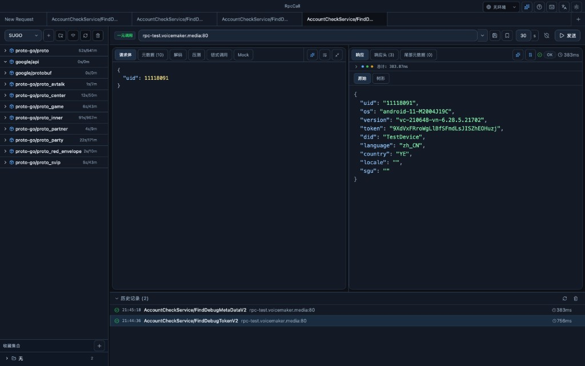
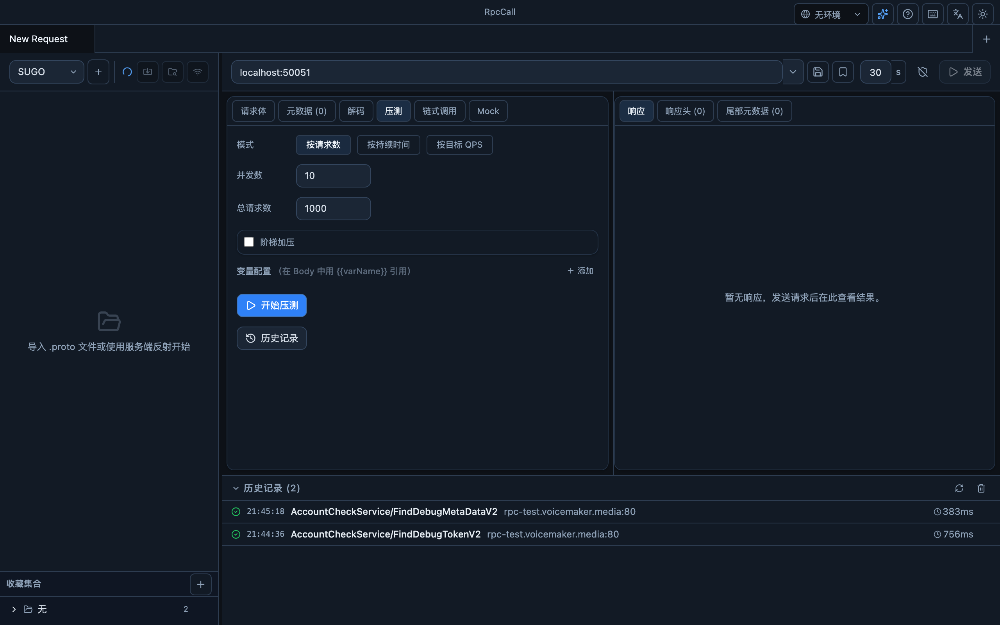
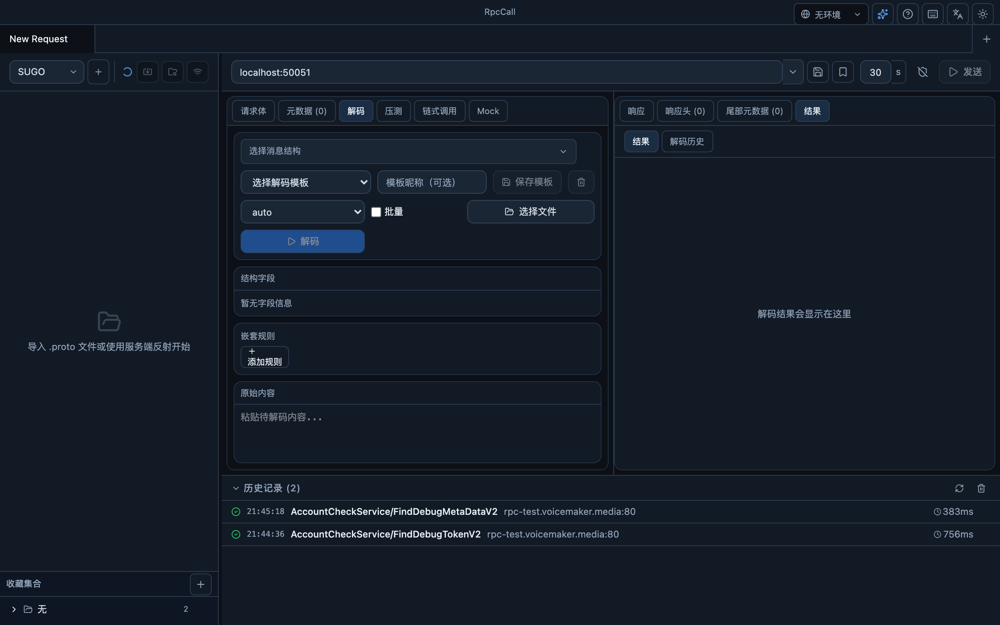
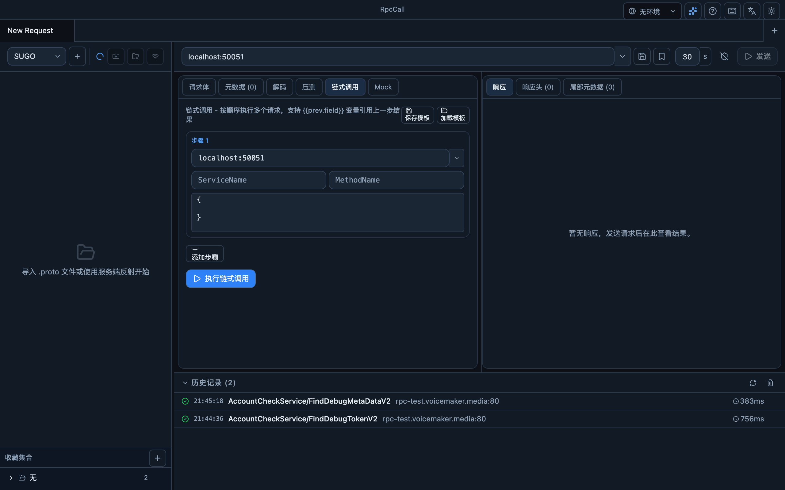
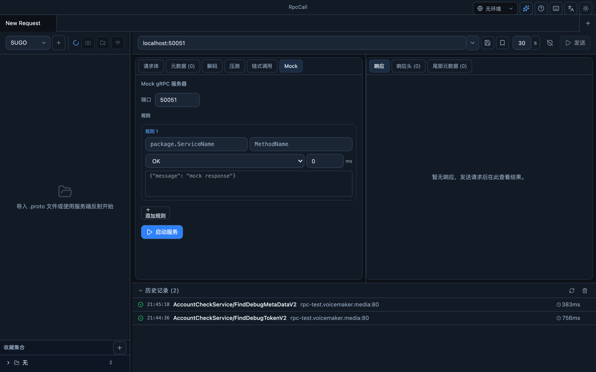
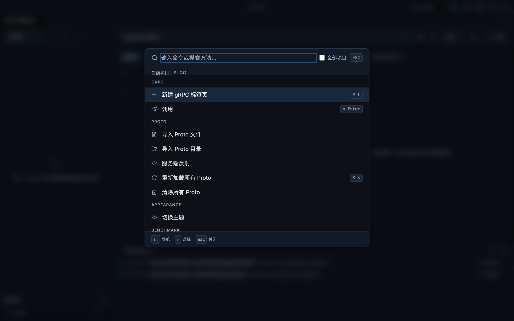

<div align="center">


# RpcCall

**一款跨平台桌面端 gRPC 调试工具 —— gRPC 界的 Postman / BloomRPC**

支持 Proto 导入与服务反射、四种 RPC 调用模式、TLS/mTLS、地址与 Metadata 偏好、压测、Mock 服务、Payload 解码、链式调用、环境变量、AI 辅助等。

基于 [Wails v2](https://wails.io)（Go 后端 + React/TypeScript 前端）构建，单文件原生应用，体积小、启动快。

</div>

---

## 界面截图

<div align="center">



</div>

<table>
<tr>
<td width="50%"><p align="center"><b>压力测试</b></p></td>
<td width="50%"><p align="center"><b>Payload 解码</b></p></td>
</tr>
<tr>
<td width="50%"><p align="center"><b>链式调用</b></p></td>
<td width="50%"><p align="center"><b>Mock 服务器</b></p></td>
</tr>
<tr>
<td colspan="2"><p align="center"><b>命令面板（⌘K）</b></p></td>
</tr>
</table>

---

## 功能特性

### 核心调用
- **四种 gRPC 调用模式**：一元（Unary）、服务端流（Server Stream）、客户端流（Client Stream）、双向流（Bidi Stream）。流式调用实时推送每条消息。
- **Proto 导入与反射**：支持导入单个 `.proto` 文件、整个目录，或通过 gRPC Server Reflection 自动发现服务。多级 import 解析，内置 `google/protobuf` 描述符。
- **请求模板自动生成**：选中方法后自动生成默认 JSON 请求体。
- **请求超时配置**：发送按钮旁可设置超时（默认 30s，范围 1–3600s）。

### 请求与响应
- **JSON 语法高亮编辑器**：请求体实时高亮，一键 **格式化 / 压缩**，`Tab` 插入两空格缩进。
- **请求参数校验**：发送前按 proto schema 校验 JSON 请求体，类型错误会在左侧行号栏标记 `×`，响应区输出完整错误列表。
- **Well-Known Types 支持**：支持 `google.protobuf.Any` 等常见 protobuf 类型；`Any` 字段可使用 `@type` JSON 写法，响应中的 `Any` 内容会自动解析并格式化展开。
- **元数据（Metadata）**：键值对编辑或 JSON 批量导入；JSON 合法时会自动应用到当前请求，非法时保留编辑状态并提示错误。支持环境变量引用；支持按地址保存默认 Metadata，并在后续请求中自动附加。
- **响应查看**：树形 / 原始两种视图，响应头 / 尾部元数据分区展示，调用计时分解（建连 / 序列化 / RPC / 总计）。
- **bytes 字段自动解码**：响应原始 / 树形视图会把看起来是 protobuf 的 base64 `bytes` 字段（如 `specData`）直接替换为解码后的原始字段结构，无需切换视图或额外选择 schema。
- **文本搜索**：`⌘F` 在请求体 / 响应体内搜索并高亮。

### 工程化能力
- **环境变量**：创建多套环境（dev / staging / prod），请求体、地址栏、Metadata 中用 `{{varName}}` 引用，发送前自动替换。
- **收藏集合（Collections）**：把完整请求配置（地址 + 方法 + Body + Metadata + TLS）按集合分组保存，一键加载到新标签页。
- **多项目隔离**：Proto 来源、解码模板按项目隔离管理。
- **历史记录 + Diff 对比**：自动记录每次请求，可回放到新标签页；`⌘`+点击选两条进行逐行 Diff 对比。
- **工作台导入 / 导出**：整体备份与迁移配置。
- **多标签页**：并行管理多个调用上下文。可为保存的地址设置默认域名，普通新建标签页会自动使用默认地址。

### 高级工具
- **压力测试（Benchmark）**：按请求数 / 持续时间 / 目标 QPS 三种模式，支持并发阶梯加压与变量注入；实时 QPS / 延迟趋势、延迟分布（P50/P90/P99）、错误码分布图表；结果可导出 JSON / CSV / HTML。
- **链式调用（Chain）**：按顺序编排多个请求，用 `{{prev.field}}` 引用上一步响应字段实现接口编排，模板可保存复用。
- **Mock 服务器**：本地启动 gRPC Mock Server，配置状态码、延迟与自定义响应体，方便前端联调。
- **Payload 解码**：将 hex / base64 / 转义 / 原始二进制内容解析为可读 JSON，支持批量解码、结果对比、嵌套字段二次解码、解码模板与历史回放。
- **AI 辅助**：配置 OpenAI 兼容接口后，可「AI 生成」请求体、「AI 分析」响应、「AI 诊断」错误。

### 连接与安全
- **TLS / mTLS**：无 TLS / 仅 CA 校验 / 双向证书（CA + 客户端证书 + 密钥）三种模式。按地址持久化 TLS 配置，443 端口默认启用 TLS。
- **地址管理**：保存常用地址并设置别名；可在地址下拉框中将某个地址设为默认域名，启动和新建普通标签页时自动填充。

### 体验
- **命令面板（`⌘K`）**：模糊搜索方法、执行命令，键盘全程操作。
- **主题与语言**：深色 / 浅色主题，中文 / 英文切换。
- **界面字号调整**：通过快捷键调整全局字号，适合高分屏、投屏演示或长时间阅读调试结果。
- **快捷键体系**：常用操作均有快捷键（见下表）。

---

## 命令面板（⌘+K）

按 `Cmd + K`（Windows/Linux 为 `Ctrl + K`）打开命令面板，可搜索并跳转 gRPC 方法，或执行新建标签页、导入 Proto、切换主题等快捷命令。

### 搜索范围

- 默认按**当前标签页绑定的项目**搜索；勾选 **全部项目** 可跨项目查找。
- **导入目录** 下拉按「导入时选择的根路径」分组（如 `proto-go`、`proto_party`、`mproject/protosrc`），与左侧服务树按 proto 父目录展示的方式**有意不同**——命令面板的分组与你在 RpcCall 里实际导入的目录一致。
- 选择 **全部文件夹** 表示不过滤目录；关闭面板后目录筛选会保留，仅清空搜索词。

### 方法搜索规则

搜索**不区分大小写**，并忽略 camelCase / 下划线 / 斜杠等分隔符（compact 匹配）。优先级大致为：**方法名** > camelCase 词段 > **服务名** > `服务/方法` 组合。

记不全完整方法名时，可输入方法名片段或服务名片段。例如 `RoomTaskService/ReportExternalShare`：

| 输入示例 | 能否匹配 | 说明 |
|----------|----------|------|
| `reportex` | ✓ | 方法名 compact 前缀 |
| `externalshare` | ✓ | 方法名后半段 |
| `roomtask` | ✓ | 服务名 `RoomTaskService` |
| `exportex` | ✗ | 与方法名 compact 串 `reportexternalshare` 不一致 |

单次最多展示 100 条方法结果；匹配过多时请缩小关键词或先选导入目录。

### 面板内快捷键

| 按键 | 功能 |
|------|------|
| `↑` / `↓` | 在命令与方法结果间导航 |
| `Enter` | 执行选中项（方法会打开新标签页并填充请求模板） |
| `Esc` | 关闭面板 |

## 界面字号调整

RpcCall 支持通过快捷键调整全局界面字号。

| 快捷键 | 功能 |
|--------|------|
| `⌘+` / `⌘=` | 调大字号 |
| `⌘-` | 调小字号 |
| `⌘0` | 恢复默认字号 |

字号档位为 `80%`、`90%`、`100%`、`110%`、`120%`、`130%`、`140%`、`150%`。设置会保存到本地，下次启动自动恢复。

---

## 地址级默认 Metadata

当某个认证 / 初始化 RPC 的响应体里返回 token、session 或 trace 信息时，可以在响应区点击 **保存默认 Metadata**，选择响应字段并映射为 metadata key。保存后，RpcCall 会按当前 `address` 自动附加这些默认 Metadata；如果请求里手动填写了同名 key，则手动值优先。

在 Request 的 **元数据** 面板中可以查看当前地址的默认 Metadata，并支持刷新、停用、编辑、保存或清除。鼠标停留在默认 Metadata 状态条上时，会展示自动附加的完整 key/value；点击编辑后可以修改配置名称，也可以增删或更新每个 Metadata 的 key/value。

点击刷新时，RpcCall 会重新调用保存默认 Metadata 时记录的来源 RPC，并按原字段映射更新默认 Metadata。刷新不会调用当前正在编辑的 RPC，也不会覆盖当前请求中手动填写的同名 Metadata。

## 默认域名

地址栏下拉框会展示已保存的地址。点击地址项右侧的星标按钮，可以将该地址设为默认域名；再次点击可取消默认。默认域名会持久化保存在本地数据库中。

设置默认域名后，RpcCall 启动时会把空白初始标签页填充为默认地址，点击「新建标签页」也会优先使用默认地址，并自动加载该地址对应的 TLS 配置。若未设置默认域名，新标签页会继续继承当前标签页的地址和 TLS 状态。

## 按地址 TLS 配置

地址栏右侧的盾牌图标用于开关 TLS，并可配置 CA / 客户端证书 / 密钥文件。RpcCall 会按 `host:port` 将 TLS 选择保存到本地数据库；切换地址时自动恢复该地址的历史配置。

若某地址尚未保存过 TLS 偏好，且端口为 **443**（HTTPS / 线上 gRPC 常用端口），则默认启用 TLS。手动关闭后会持久化保存，下次仍保持关闭。

## 环境变量

在顶部环境选择器旁点击管理按钮，可创建多个环境（如「测试」「线上」），每个环境定义一组 `key = value` 变量。切换环境后，所有请求中出现的 `{{key}}` 占位符会在发送前自动替换为对应值。

替换覆盖范围：

- **请求体**（JSON 中的 `{{uid}}`、`{{token}}` 等）
- **Metadata** 的 value 字段
- **地址栏**（`{{host}}:{{port}}`）
- **压测**和**链式调用**的每一步同样替换

> 注意：环境变量值是原始字符串，不会自动做 JSON 转义。若值含 `"`、`\` 等特殊字符且插入在 JSON 字符串值位置，需自行在变量值中转义。

---

## 快速开始

### 环境要求
- [Go](https://go.dev/) ≥ 1.24
- [Node.js](https://nodejs.org/) ≥ 18 + npm
- [Wails CLI v2](https://wails.io/docs/gettingstarted/installation)

```bash
go install github.com/wailsapp/wails/v2/cmd/wails@v2.11.0
# 确保 $(go env GOPATH)/bin 在 PATH 中
wails doctor   # 检查环境
```

### 开发模式（热重载）

```bash
wails dev
```

自动安装前端依赖并启动 Vite，Go 与前端均热重载；也可在浏览器访问 `http://localhost:34115` 调试。

> 注意：`wails dev` 退出时会删除它生成的开发二进制，因此退出后不要直接 `open build/bin/RpcCall.app`。需要打开生产构建时，先执行 `wails build`，或直接使用 `./scripts/open.sh`，脚本会在可执行文件缺失时自动先构建再打开。

### 生产构建

```bash
wails build      # 产物输出到 build/bin/RpcCall.app（macOS）
```

构建产物位于 `build/bin/RpcCall.app`。打开方式：

```bash
open build/bin/RpcCall.app
# 或使用自动补构建脚本：
./scripts/open.sh
```

### macOS 下载安装（DMG）

从 [GitHub Releases](https://github.com/churu1/rpcCall/releases) 下载 `RpcCall-<version>-macos.dmg`，双击挂载后把 **RpcCall** 拖入 **Applications** 文件夹即可。

> 应用未做 Apple Developer ID 签名与公证。首次打开如果提示「RpcCall.app 已损坏，无法打开」，请在终端执行：
>
> ```bash
> xattr -dr com.apple.quarantine /Applications/RpcCall.app
> open /Applications/RpcCall.app
> ```
>
> 该命令只移除 RpcCall 的下载隔离标记。

### 打包 DMG（开发者）

```bash
./scripts/build-dmg.sh   # 读取 wails.json 中的 productVersion，输出 build/bin/RpcCall-<version>-macos.dmg
```

脚本内部依次执行 `wails build` 与 `hdiutil`，无需额外依赖。如需更换 Go 模块代理，可前置 `GOPROXY=https://proxy.golang.org,direct`。

### 运行测试

```bash
go test ./...
go test ./internal/grpc -v
```

---

## 快捷键

| 快捷键 | 功能 |
|--------|------|
| `⌘K` | 打开 / 关闭命令面板 |
| `⌘T` | 新建标签页 |
| `⌘W` | 关闭当前标签页 |
| `⌘Enter` | 发送请求（在请求体编辑器中不会换行） |
| `⌘R` | 重新加载所有 Proto |
| `⌘F` | 搜索文本（请求体 / 响应体） |
| `⌘Shift+D` | 打开解码面板 |
| `⌘Shift+B` | 批量解码 |
| `⌘/` | 显示快捷键参考 |
| `⌘+` / `⌘=` | 调大界面字号 |
| `⌘-` | 调小界面字号 |
| `⌘0` | 恢复默认字号 |
| `Tab` | 编辑器内插入两空格缩进 |
| `Esc` | 关闭搜索 / 弹窗 |

---

## 更新日志

| 日期 | 功能 |
|------|------|
| 2026-08-05 | 修复 `wails dev` 退出会删除 `build/bin/RpcCall.app` 可执行文件导致 `open` 报错的问题；新增 `scripts/open.sh`，可执行文件缺失时自动先构建再打开 |
| 2026-08-03 | 响应原始/树形视图直接解码 base64 protobuf `bytes` 字段：无需嵌套 schema，也无需切换视图，即可把 `specData` 这类字段显示为原始字段编号结构 |
| 2026-07-27 | 新增默认域名偏好：可在地址下拉框中设为默认，普通新标签页和启动初始页自动填充并加载对应 TLS 配置；Metadata 面板默认提供 JSON 批量编辑模式，合法 JSON 自动应用到请求，错误会保留并提示；自动附加的地址级 Metadata 支持编辑配置名和 key/value 后持久化保存 |
| 2026-07-09 | 支持发送前 proto schema 请求校验，JSON 语法错误和字段类型错误会在请求体行号栏标记，并在响应区输出完整错误列表；支持 `google.protobuf.Any` 请求与响应解析，覆盖普通调用、流式调用、压测、Mock 与 Payload 解码；响应中的 `Any` 内部 JSON 会自动格式化展开，默认请求模板会尽量按字段名推断并展开 `Any` 类型，推断不到时生成 `@type` 占位 |
| 2026-07-05 | 历史面板客户端模糊搜索（按方法/地址/状态过滤）+ 分批加载；请求编辑器一键导出 grpcurl 命令（含 TLS/metadata flags）；Tab 未保存改动提示（仅对存入 Collection 的请求生效）+ 右键菜单批量关闭；链式调用变量支持 dot-path 嵌套与数组下标 `{{prev.user.id}}` / `{{prev.items[0]}}`，逐步执行进度事件，每步内联展示上一步响应字段并点击插入变量；Benchmark 历史 ⌘+点击多选两条做指标/延迟分桶/配置对比；新增通用 ConfirmDialog UI 组件 |
| 2026-07-05 | 环境变量 `{{key}}` 替换覆盖请求体/Metadata/地址/压测/链式调用；`Cmd+Enter` 在请求体编辑器中直接发送不再换行；历史记录改为事件驱动即时刷新 |
| 2026-07-04 | 按地址持久化 TLS 配置；443 端口默认启用 TLS；解码 tab 两层选择 proto 文件与消息结构，并优化搜索性能；请求/解码历史各最多保留 500 条；⌘+K 命令面板：按导入目录筛选、不区分大小写的 compact 方法搜索 |
| 2026-06-21 | 地址级默认 Metadata：从 RPC 响应字段映射到 metadata key，按地址自动附加，支持刷新与手动值优先 |

---

## 技术栈

| 层 | 技术 |
|----|------|
| 桌面框架 | Wails v2.11 |
| 后端 | Go 1.24 · `jhump/protoreflect` · `google.golang.org/grpc` |
| 存储 | SQLite（`modernc.org/sqlite`，纯 Go 无 CGO） |
| 前端 | React 18 · TypeScript 5 · Vite 5 · Zustand · Radix UI |
| 样式 | Tailwind CSS v4 · CSS 变量主题 |

数据库位置：`~/Library/Application Support/RpcCall/history.db`

---

## 项目结构

```
rpcCall/
├── main.go                 # 应用入口，Wails 配置 + 前端 embed
├── app.go                  # IPC 桥接层，对前端暴露后端方法
├── internal/
│   ├── grpc/               # gRPC 调用引擎、proto 解析、反射、解码、压测、Mock、连接
│   ├── history/            # SQLite 持久化
│   ├── models/             # 共享数据模型
│   ├── ai/                 # AI 客户端
│   └── logger/             # 文件日志
├── frontend/               # React + TS 前端（components / store / i18n）
└── docs/                   # 架构、功能与开发文档
```

更详细的架构说明见 [`docs/project-architecture.md`](docs/project-architecture.md)。
